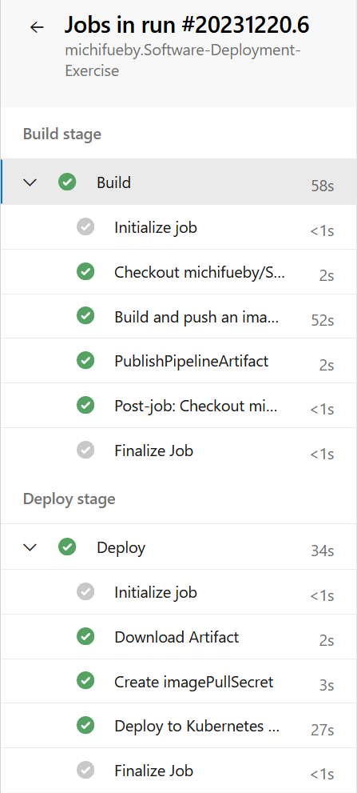

# Task

The point of this exercise is to create a containerized DevOps pipeline which provides a Node.js application in AKS. This project will build on the example created in Lab2 and the DevOps project.

As soon as a new CheckIn is created in GIT, the pipeline should be triggered and perform the following actions:
- Build a Docker image
- Store the image in a registry
- Deploy the new image in the AKS and make it available under a public IP

## Build a Docker image

For the first step, a Dockerfile is created to automatically build a Node.js application using Node.js version 18 as its base image, and expose it to port 3000. 

The file contains the following commands:

```FROM node:18
WORKDIR /usr/src/app
COPY package*.json ./
RUN npm install
COPY . .
EXPOSE 3000
CMD [ "node", "index.js" ]```


## Store the image in a registry

In order to store and manage our docker images, we need to store them in a registry. We store the image in the following url: schlauhausregistry.azurecr.io and name the repository schlauhausbild. This is done with the following commands:

```docker tag schlauhausbild:$(Build.BuildId) schlauhausregistry.azurecr.io/schlauhausbild:$(Build.BuildId)

docker push schlauhausregistry.azurecr.io/schlauhausbild:$(Build.BuildId)```

### Azure Pipeline

The following picture shows the successful execution of the pipeline.


It builds the Docker image, stores it in the container registry in the repository, and deploys a container to the AKS cluster.

Link to Docker image `schlauhausregistry.azurecr.io/schlauhausbild`

Following you can see the yaml file. The manifest files are described in the next section:
```yaml
# Deploy to Azure Kubernetes Service
# Build and push image to Azure Container Registry; Deploy to Azure Kubernetes Service
# https://docs.microsoft.com/azure/devops/pipelines/languages/docker

trigger:
- main

resources:
- repo: self

variables:

  # Container registry service connection established during pipeline creation
  dockerRegistryServiceConnection: '8964bd80-2e4e-455a-a7ed-bdb6d4eaa3ac'
  imageRepository: 'schlauhausbild'
  containerRegistry: 'schlauhausregistry.azurecr.io'
  dockerfilePath: '**/Dockerfile'
  tag: '$(Build.BuildId)'
  imagePullSecret: 'schlauhausregistry121238ab-auth'

  # Agent VM image name
  vmImageName: 'ubuntu-latest'


stages:
- stage: Build
  displayName: Build stage
  jobs:
  - job: Build
    displayName: Build
    pool:
      vmImage: $(vmImageName)
    steps:
    - task: Docker@2
      displayName: Build and push an image to container registry
      inputs:
        command: buildAndPush
        repository: $(imageRepository)
        dockerfile: $(dockerfilePath)
        containerRegistry: $(dockerRegistryServiceConnection)
        tags: |
          $(tag)

    - upload: manifests
      artifact: manifests

- stage: Deploy
  displayName: Deploy stage
  dependsOn: Build

  jobs:
  - deployment: Deploy
    displayName: Deploy
    pool:
      vmImage: $(vmImageName)
    environment: 'michifuebySoftwareDeploymentExercise.default'
    strategy:
      runOnce:
        deploy:
          steps:
          - task: KubernetesManifest@0
            displayName: Create imagePullSecret
            inputs:
              action: createSecret
              secretName: $(imagePullSecret)
              dockerRegistryEndpoint: $(dockerRegistryServiceConnection)

          - task: KubernetesManifest@0
            displayName: Deploy to Kubernetes cluster
            inputs:
              action: deploy
              manifests: |
                $(Pipeline.Workspace)/manifests/deployment.yml
                $(Pipeline.Workspace)/manifests/service.yml
              imagePullSecrets: |
                $(imagePullSecret)
              containers: |
                $(containerRegistry)/$(imageRepository):$(tag)
```

## Deploy the new image in the AKS and make it available under a public IP

Two YAML files were created in the manifests folder with the names **service.yml** and **deployment.yml** <br>

The first YAML file **service.yml** creates a Kubernetes service of the type "LoadBalancer" with the name "sd-exercise", which listens on port 3000 and communicates with pods that have the label "app: sd-exercise". The load balancer enables external access to the application by distributing the incoming traffic to the corresponding pods. <br>

The second YAML file **deployment.yml** creates a Kubernetes deployment called "sd-exercise", which creates a replica (pod) of the application. The pod is labeled "app: sd-exercise" and contains a container that is created from the specified Docker image and listens on port 3000.

Used Links:
- [Deploy an Azure Kubernetes Service (AKS) cluster](https://learn.microsoft.com/en-us/azure/aks/learn/quick-kubernetes-deploy-portal?tabs=azure-cli)

Public IP address: `http://20.79.135.78:3000`
